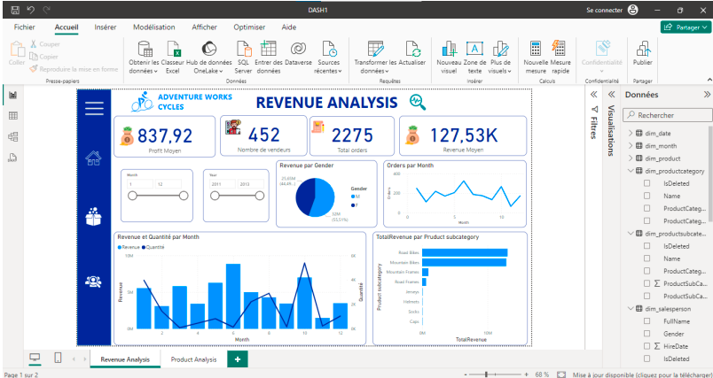

# Business Intelligence and Sales Predictive Analytics for AdventureWorks 2019

## Project Overview
This project demonstrates the implementation of a complete Business Intelligence (BI) and Machine Learning (ML) solution using the AdventureWorks 2019 dataset.
The goal is to transform raw business data into actionable insights through data extraction, transformation, warehousing, modeling, and visualization.

It highlights how modern BI tools (SQL Server, SSIS, SSAS, Power BI, and Python) can support strategic decision-making in areas such as sales performance, product optimization, and revenue forecasting.

## Project Architecture
The solution follows a traditional end-to-end BI pipeline:

1. **Data Collection :** Source data retrieved from Microsoft’s AdventureWorks2019 relational database.

2. **ETL Process (Extract, Transform, Load) - Built using SQL Server Integration Services (SSIS):**

* Extract data from multiple tables:** (Product, SalesOrder, Employee, Territory, etc.)
* Transform and clean it in staging tables
* Load data into a centralized Data Warehouse

3. **Data Modeling (SSAS) :** Creation of OLAP cubes in SQL Server Analysis Services to enable multidimensional analysis (by time, geography, product, etc.).

4. **Machine Learning (Python) :** Predictive modeling for sales and product classification using:

* Prophet (time-series revenue forecasting)
* Random Forest Classifier (product category prediction)
* Random Forest Regressor (quantity sold prediction)

5. **Visualization (Power BI) :** Creation of interactive dashboards for:

* Sales and revenue trends
* Product performance
* Regional insights
* Forecasting results

## Dataset Description
AdventureWorks 2019 is a public dataset provided by Microsoft, representing a fictional company that manufactures and sells bicycles and accessories worldwide.
It is commonly used for data analysis, SQL practice, and BI demonstrations.

| Table                             | Description                                                    |
| --------------------------------- | -------------------------------------------------------------- |
| **Person**                        | Information about customers and employees (name, gender, etc.) |
| **Product**                       | Product details (name, description, price, stock info)         |
| **Employee**                      | Employee information (ID, hire date, etc.)                     |
| **SalesOrderHeader**              | Sales orders (order date, customer ID, total amount)           |
| **SalesOrderDetail**              | Line items for each order (product ID, quantity, unit price)   |
| **Territory**                     | Geographic regions linked to sales data                        |
| **ProductCategory / SubCategory** | Product classification hierarchy                               |

These tables were transformed into:

* Dimension Tables (Dim_*) : descriptive data (Product, Date, Territory, etc.)

* Fact Tables (Fact_*) : transactional data (Sales, Product performance)

## 🤖 Machine Learning Components

1. Revenue Forecasting

* Algorithm: Prophet
* Goal: Predict future annual and regional revenues
* Output: Interactive trend charts and 5-year revenue projections

2. Product Classification

* Algorithm: Random Forest Classifier
* Goal: Predict product categories based on attributes (price, region, etc.)
* Evaluation Metrics: Accuracy score, confusion matrix

3. Sales Quantity Prediction

* Algorithm: Random Forest Regressor
* Goal: Estimate quantities sold using pricing and geographic features
* Metrics: Mean Squared Error (MSE), R² Score

## Dashboards
Developed in Power BI Desktop, the dashboards provide dynamic insights into:

* **Revenue Analysis Dashboard:**
Displays KPIs (average profit, total orders, seller count), revenue by gender, monthly trends, and top product subcategories.

* **Product Analysis Dashboard:**
Highlights product quantities by subcategory, revenue by region, and annual forecast trends.

## 🛠️ Tools & Technologies

| Category             | Tools                                       |
| -------------------- | ------------------------------------------- |
| **Database & ETL**   | SQL Server, SSIS                            |
| **Data Modeling**    | SSAS (OLAP Cubes)                           |
| **Programming & ML** | Python (Pandas, Prophet, scikit-learn)      |
| **Visualization**    | Power BI Desktop                            |
| **Dataset**          | AdventureWorks 2019 (Microsoft sample data) |

## ✨ Happy Analytics !
